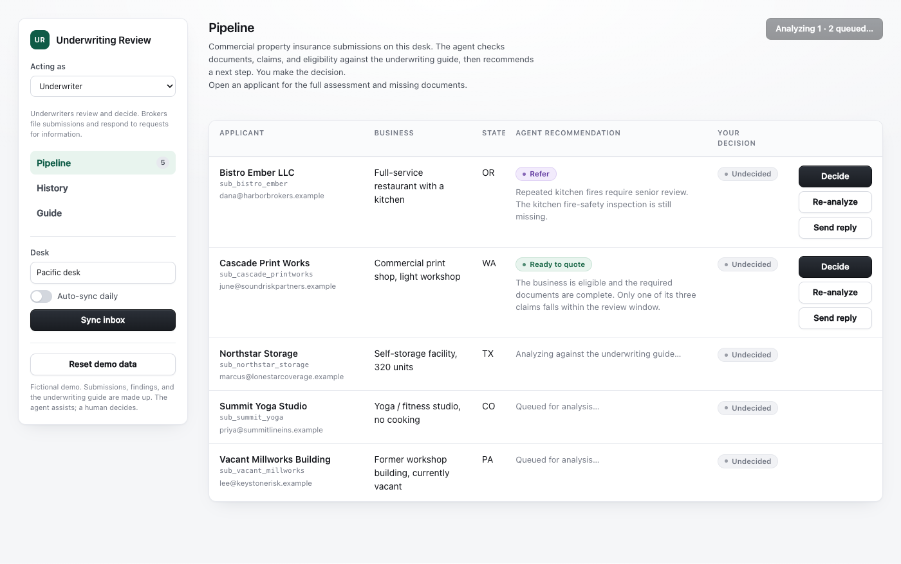

# Underwriting Review Example



*Illustrative review state using the demo submissions.*

An Amodal agent that helps an underwriter review commercial property
insurance submissions. A broker files the business details and documents.
The agent checks the packet, claims history, and eligibility against a
fictional underwriting guide, then recommends whether to quote, request
information, refer for senior review, or decline. Each row explains the
recommendation. The underwriter opens the full assessment and records the
decision; the broker can supply missing information and resubmit.

The agent runs on the Amodal runtime, which also serves the React UI. Two
underwriting desks share one deployment, with separate submissions, agent
memory, and sessions through `scope_id`. Gmail can bring broker submissions
in and send reviewed outcomes back with the operator's confirmation.

Re-analysis refreshes the recommendation while preserving the underwriter's
decision and workflow status. A broker resubmission starts another review.

This is **step 12** of a guided, incremental series. See
[The demo in steps](#the-demo-in-steps) to jump to any stage.

> Fictional demo. The agent recommends a workflow status and conditions only.
> It does not bind coverage, calculate premium, or give regulatory/legal
> advice.

## The demo in steps

This repo isn't one finished app: it's a guided build. Each step adds one
concept on top of the step before it, so the demo grows from "the simplest
thing that runs" to "shipped in a product" one idea at a time. Every past step
is a self-contained snapshot under [`steps/`](steps/); **the repo root is
always the current step**. Two ways to use it:

- Open a step folder to see the whole app frozen at that stage: read its
  `README.md`, deploy it as-is.
- Diff two adjacent steps to see precisely what that one concept changed:
  `diff -r steps/05-custom-ui steps/06-guardrail-hooks`. To diff the last
  snapshot against the current step (the root):
  `diff -r -x steps -x node_modules -x dist steps/11-memory-and-surfaces .`

**You are here: step 12**, the repo root. This README describes the app at
this step.

| Step                                                    | What you learn                                                                                                 |
| ------------------------------------------------------- | -------------------------------------------------------------------------------------------------------------- |
| [`steps/01`](steps/01-skills-and-knowledge/)            | The runtime loop and context compiler, and the core primitives: skills and knowledge                           |
| [`steps/02`](steps/02-stores/)                          | Stores, the CRUD tools Amodal generates, and an append-only trail beside the row tables                              |
| [`steps/03`](steps/03-code-vs-llm/)                     | Splitting work between code and the LLM: deterministic logic in a custom tool vs. judgment in a reviewer subagent |
| [`steps/04`](steps/04-evals/)                           | Evals as quality gates: pin the reviewer's judgment down before you build surfaces on top of it                |
| [`steps/05`](steps/05-custom-ui/)                       | Going beyond hosted chat: a custom UI with `runtimeApp`, roles and routes, and tools the model cannot call                       |
| [`steps/06`](steps/06-guardrail-hooks/)                 | Guardrail hooks: validate model-selected calls with store-backed rules                                |
| [`steps/07`](steps/07-gmail-connection/)                | External connections: Gmail policies and a public weather API through native OpenAPI discovery                 |
| [`steps/08`](steps/08-custom-tool/)                     | Writing a custom tool when a Markdown skill and a schema aren't enough                                         |
| [`steps/09`](steps/09-model-delegation/)                | Model-initiated delegation: the chat agent dispatching a subagent itself via `call_subagent`                   |
| [`steps/10`](steps/10-automations/)                     | Background automations: scheduled runs that need no UI open, and what a confirm gate means with no human present |
| [`steps/11`](steps/11-memory-and-surfaces/)             | Memory and conditional surfaces: one deployed agent whose capabilities vary per caller (`claims`, `humanPresent`) |
| **step 12** (repo root, you are here)                   | Embedding & multi-tenancy: the agent in your own app, with your auth and a `scope_id` per tenant               |

> See [`steps/README.md`](steps/README.md) for how the step snapshots are
> maintained and how new steps are added.

## The one idea this step teaches: embedding & multi-tenancy

Eleven steps built one app for one desk. Real products serve many: tenants,
teams, cases, workspaces. Step 12 makes the same deployed agent serve two
underwriting desks whose data never meets, with one primitive: `scope_id`.

What a scope is. A stable string your application chooses (`desk-pacific`,
`tenant:acme`, `case:merchant-123`) and sends with each request. The runtime
uses it to partition every stateful resource: store rows, agent memory,
session records, and per-scope credentials. Nothing about the agent's code
changes per tenant: the same tools, prompt, and guide run against whichever
partition the request names. Without a `scope_id`, requests share one global
partition, which is what steps 1-11 (and the eval suite) were using all
along.

Who says which scope. The UI's desk picker sends the selected desk as
`scopeId` on every lane: the chat (`ChatWidget scopeId`, the Analyze
button's `chatStream`, and the weather panel's `chatStream`), the invoke-lane tools (`useToolRun('...', { scopeId })`),
and the automation binding (`useAutomation({ scopeId })`, so each desk owns
its own auto-sync). This demo runs with identity `none`, so the scope rides
the request body and the app is trusted for it. In a real embedding your
backend is the security boundary: it mints a JWT with `scope_id` (and
`context`) as claims, the SDK passes it via `getToken`, and a verified claim
**replaces** any body value, so a client cannot pick another tenant's scope.
Production also sets `scope: { requireScope: true }` in `amodal.json` so an
unscoped request fails instead of quietly using the global partition.

The read path has to be scoped too. The runtime's direct store REST reads
(what `useStoreQuery` hits) see only the agent-level partition, so a desk's
rows are invisible to them. The table therefore reads through
[`list_pipeline`](amodal/tools/list_pipeline/handler.ts), a read-only durable
invoke tool: the run carries the desk's `scope_id`, its store tools read that
desk's partition, and the rows ride back on the run result. The rule it
teaches: in a scoped app, data flows through scoped runs, end to end.

What memory does now. Step 11's standing guidance was per-agent; with scopes
it is per desk automatically, because memory partitions by scope like
everything else. Tell the Pacific desk "we're not writing vacant buildings"
and the Atlantic desk never hears it: same agent, different institutional
memory.

Pending actions retain their desk. Switching desks closes confirmations.
Analysis progress and errors appear only on their own desk. A delayed
completion cannot navigate or dismiss controls in a different desk.

Desks and personas are different axes. The desk is a runtime partition: it
decides which rows exist and is enforced by the platform. The persona from
step 5 is a screen role: it decides how those rows are shown and is enforced
by nothing, because the runtime gives the custom UI no user identity. Every
combination is valid, and picking a desk never changes what a role may do.
`decide_submission` and `submit_submission` are absent from every agent's
`tools` list. The model-store-write guard also blocks direct store mutations,
so the model cannot record either action on either desk.

See the diff: `diff -r -x steps -x node_modules -x dist steps/11-memory-and-surfaces .`

## Live weather alerts through OpenAPI

Open an applicant as the underwriter and click **Check weather alerts**.
Northstar Storage is a useful example: its Texas submission gives the
lookup a state without needing an address or geocoding service. The panel
reports current alert types, severity, affected areas, and expiry times,
with a source link and the time of the check. No account or API key is
required. A state can have no active alerts; an unavailable service is
shown as a failed check.

The [`weather` agent](agents/weather/AGENT.md) holds only the
[NWS connection](amodal/connections/weather/README.md). The UI sends a
chat request to that agent. It discovers the operation from the checked-in
OpenAPI contract, calls the generated tool, and reads paged results when
the response is large. The panel accepts a report only after a successful
native alert call. The agent has no store grants or decision tools.
The `weather-alerts` eval checks discovery and source-grounded reporting;
`weather-read-only` checks that this surface refuses decision and email
requests. The live eval needs an available NWS service.

This teaches a second way to connect: Gmail uses an installed driver;
weather uses an API contract and the runtime's native discovery. The
explicit `openapi.source` block in `spec.json` enables it. Placing an
`openapi.json` file in a connection directory alone does not.

Statewide alerts are context for the operator. They do not establish that
a particular property is affected, measure long-term exposure, or change
the saved assessment. The feature requires a Cloud runtime with native
OpenAPI discovery support and internet access to NWS.

## How it works

Store changes belong to the authored workflow tools. The default agent keeps
`rw` store grants because composite tools need their declared writers registered.
[`model-store-write-guard`](hooks/model-store-write-guard/index.mjs) blocks
model-selected `store__*__set` and `store__*__remove` calls, so the model cannot
forge a decision, alter a packet, or invent an audit event directly. Store
reads and the declared workflow entry points remain available.

`preToolUse` guards model-selected calls. Nested calls made by authored
composite and durable handlers do not pass through this hook. Each handler
must enforce the rules for its own writes and external calls.

The two chat commands are triggers: a regex in the tool's own `tool.json`
fires the tool from the request path, before the LLM sees the message, and
the model then reports the tool's result:

- send **`seed`** → the
  [`seed_examples`](amodal/tools/seed_examples/tool.json) tool loads the demo
  submissions, their documents, and their claims into the stores. The UI runs
  the same tool over the invoke lane the first time a desk opens empty, so
  the chat command only matters after something deleted a demo row.
- send **`analyze sub_bistro_ember`** (or `triage` / `review` / `assess` + an id)
  → the [`analyze_submission`](amodal/tools/analyze_submission/tool.json)
  composite tool runs the triage. As it works it narrates the deterministic
  steps into the chat's reasoning block (`ctx.emitReasoning`).

The UI controls:

- the **desk picker** selects the `scope_id` every other control runs under.
  Switching desks swaps the whole surface's data: table, chat, memory, and
  the auto-sync binding are all per-desk partitions of the same deployed
  agent.
- **Reset demo data** → the [`reset_demo`](amodal/tools/reset_demo/tool.json)
  tool, behind a confirm modal: it removes every row in the desk's four
  stores and loads the demo dataset again.
- the **Sync inbox** button →
  [`sync_submissions`](amodal/tools/sync_submissions/handler.ts), a durable
  tool on the direct-invoke lane (Gmail read-only surface): reads the broker
  mail and files submissions into the stores. Falls back to the demo dataset
  when no mailbox is connected.
- the **Analyze** button sends the same `analyze <id>` command through the
  chat surface (`RuntimeClient.chatStream`), so it enters through the same
  trigger as the chat command and cannot drift from it.
- the **Send reply** button →
  [`send_outcome`](amodal/tools/send_outcome/handler.ts), a durable tool on
  the direct-invoke lane (Gmail confirm surface): emails the decision back to
  the broker, only after the operator confirms the exact message.
- the **Auto-sync daily** toggle → `useAutomation()`: creates (then
  enables/disables) a platform-managed binding that runs `sync_submissions`
  once a day with no UI open. The management surface lives in the cloud
  runtime, so locally the toggle degrades to a "cloud only" note.

Both buttons call `POST /api/tools/<name>/run` via `useToolRun`; the
`{"kind": "invoke"}` trigger in each tool's `tool.json` is the opt-in to that
lane, and neither tool is in any agent's `tools` list, so the model cannot
call them.

Both `analyze` entry points run the same four-stage Amodal loop, in the shared
[`runUnderwritingAnalysis`](amodal/_lib/underwriting-analysis.ts) behind the
composite tool. The tool declares everything it composes in `uses` (the store
tools and the reviewer subagent); undeclared calls fail closed:

1. **load**: reads the submission, its `documents`, and its `claims` from the
   stores via the auto-generated `store__*__get` / `store__*__query` tools
   (`ctx.callTool`).
2. **check (in code)**: computes the completeness check deterministically in
   TypeScript: any `required` document whose status isn't `received` is missing,
   full stop. A rule, not a judgment, so code decides it and hands the reviewer
   the result as fact.
3. **review (in the subagent)**: `ctx.callSubagent` runs the
   [`underwriting-reviewer`](agents/underwriting-reviewer/AGENT.md) subagent,
   which applies the [underwriting guide](amodal/knowledge/underwriting-guide.md)
   (passed in as input; subagents see only their own prompt) and makes the
   judgment a formula can't (eligibility, hazards, claims severity, one
   recommendation). Mid-review it calls the
   [`claims_stats`](amodal/tools/claims-stats/tool.ts) custom tool for the
   claims arithmetic (counts, the 3-year window from the real clock, largest
   amount, open claims) and treats those numbers as fact. Judging the repeat
   cause stays its own job. Its reply is a single JSON object the composite
   parses.
4. **record**: code holds the floor on the way out: it folds the deterministic
   missing-docs list into the finding and won't let a packet with missing
   required docs be `ready-to-quote`. If code overrides the recommendation, the
   saved summary explains why. Then it writes a `risk_findings` row,
   stamps the submission, and appends an `analyzed` row to the `events` store,
   naming the recommendation and the score. It then reports: the model
   summarizes the tool result in chat, and the UI refetches its table through
   `list_pipeline`. The `ready-to-quote-guard` hook backstops the missing-docs
   rule on model-selected writes.

What-if questions take a different path (and only for a present human: the
dispatch entry is conditional in `agent.ts`). They don't match the `analyze`
trigger, so they reach the model, and the chat prompt tells it to delegate:
read the submission's rows from the stores, then dispatch the
underwriting-reviewer via `call_subagent` with the rows as `input` and the
hypothetical stated in the `task`. The reviewer loads the guide itself
(`load_knowledge`), calls `claims_stats` for the arithmetic as always, and
returns the same JSON shape. The model reports it as a hypothetical and writes
nothing: the stored finding is whatever `analyze_submission` last saved.

Once a submission has a finding, **Send reply** runs `send_outcome`. The email
uses the saved human decision, or the agent's recommendation before a decision.
Quotes retain their conditions. Declines and referrals omit information requests
and quote conditions. The [reply formatter](amodal/_lib/reply.ts) builds both the
preview and the sent message. The audit event records the outcome emailed.
The handler checks the saved finding and broker address before it sends. The
`outbound-reply-guard` separately checks model-selected `send_message` calls;
it does not intercept the handler's nested send.

The UI submits the confirmed recipient, subject, and body with the send request.
The handler rebuilds the email from current rows and rejects any mismatch
before calling Gmail. If another tab changed the reply, close the dialog,
refresh the page, and reopen **Send reply** to review it again. Direct callers
must provide `confirmation: { to, subject, body }`; an optional `message` note
must be included in the confirmed final body.

How do submissions arrive? The first time a desk opens empty, the UI runs
`seed_examples` over the invoke lane and the five demo submissions land in
that desk's partition. Real mail comes through `sync_submissions` (the
read-only surface), fired by the **Sync inbox** button or, once **Auto-sync
daily** is on, by the scheduled binding with nobody watching: with a mailbox
connected it reads real broker mail; with none it confirms the demo is
already filed. **Reset demo data** empties the desk and seeds it again, and
the `seed` chat command (a regex trigger on the same tool, idempotent) loads
whatever is missing. Either way, a run doesn't see its own uncommitted
writes: `analyze` reads already-committed data from a prior seed or sync, and
on fresh stores it falls back to the in-memory demo examples while seeding the
stores for later runs.

The UI carries the rest of the workflow, and none of it runs through chat.
The rail switches between the underwriter and the broker: a screen role, not a
permission, since the runtime gives the custom UI no user identity. What is
enforced is that `decide_submission` and `submit_submission` are in no agent's
`tools` list and have no trigger, so the model cannot record a decision or file
paperwork whoever is looking. **Analyze all** pushes every un-analysed
submission through a serial queue, and the same queue triages the desk once
after the first load. **History** reads the `events` trail, each submission's
detail screen shows its own slice of it, and **Guide** renders the same
underwriting guide file the reviewer subagent is given.

When analyzing a saved packet, the tool reads the submission again after the
reviewer returns. A deleted or recreated submission or changed revision rejects the result
before any review writes. An unchanged revision keeps the latest human decision
and reply fields. The final read and writes are separate operations: a write
after this check can still race with the save. Packets filed or seeded in the
same durable run use in-memory rows because pending writes cannot be read back.

## What's in here

| Path                                                  | What it is                                                                                                                     |
| ----------------------------------------------------- | ------------------------------------------------------------------------------------------------------------------------------ |
| `amodal.json`                                         | Manifest: five stores, the `gmail` package, and `runtimeApp: { custom: true }`.                                                |
| `hooks/model-store-write-guard/`                      | Blocks direct model store mutations; authored workflow tools own writes. |
| `agents/default/`                                     | The chat agent: `AGENT.md` (prompt), `agent.json` (stores), and `agent.ts`, the code form whose tool/subagent entries carry `humanPresent` conditionals. |
| `agents/underwriting-reviewer/`                       | The reviewer subagent that scores against the underwriting guide. Its `agent.json` grants `claims_stats` + `load_knowledge`.   |
| `amodal/connections/gmail/`                           | The Gmail connection: `spec.json` (bound by `protocol`, env-based token) + README. Read + confirm surfaces.                    |
| `amodal/tools/analyze_submission/`                    | The composite triage tool (`tool.json` + `handler.ts`): declares its `uses` (store tools + the reviewer) and the `analyze` regex trigger. |
| `amodal/tools/decide_submission/`                     | The human decision, invoke-only and in no agent's tools: the model cannot call it.             |
| `amodal/tools/submit_submission/`                     | The broker's filing, invoke-only: writes the packet and reviews it in one durable run.         |
| `amodal/tools/seed_examples/`                         | The durable seeding tool: the UI runs it over the invoke lane on first open, the `seed` regex trigger runs it from chat.       |
| `amodal/tools/reset_demo/`                            | Durable invoke-lane tool for **Reset demo data**: lists and removes every row in the five stores, then seeds blind.            |
| `amodal/tools/claims-stats/`                          | The custom tool: deterministic claims arithmetic the reviewer calls mid-reasoning. Numbers, never verdicts.                    |
| `evals/`                                              | The eval suite from step 4, grown with each step; `whatif-inspection-received` covers the new dispatch path. Re-run it before promoting. `never-decides` and `submission-history` cover the boundary the UI depends on. |
| `amodal/tools/sync_submissions/`                      | Durable invoke-lane tool for **Sync inbox**: the Gmail read-only surface (`read_messages` + offline fallback).                 |
| `amodal/tools/list_pipeline/`                         | Read-only invoke-lane tool behind the table: the scoped read, since direct store REST reads never see a scope's partition.     |
| `amodal/tools/send_outcome/`                          | Durable invoke-lane tool for **Send reply**: the Gmail confirm surface (`send_message`), operator-gated.                       |
| `amodal/_lib/underwriting-analysis.ts`                | The shared triage behind the composite tool: both entry points run it, so they can't drift.                                    |
| `amodal/_lib/reset.ts`                                | `resetDemo`: the remove-then-seed sequence behind `reset_demo`.                                                                |
| `amodal/_lib/decision.ts`                             | The decision rules, imported by both the handler and the modal so they cannot disagree.        |
| `amodal/_lib/submit.ts`                               | `submitSubmission`: file the packet, record the event, review what the run already holds.      |
| `amodal/_lib/events.ts`                               | `appendEvent`: the one place this repo writes the `events` trail.                              |
| `amodal/_types/`                                      | Vendored runtime types (`CustomToolContext` / `ToolDefinition`, `AgentDefinition` / `AgentSurfaceContext`), kept local so the example typechecks offline. |
| `amodal/knowledge/underwriting-guide.md`              | The fictional underwriting guide the reviewer reasons over (passed to it as input).                                            |
| `amodal/stores/`                                      | 5 store schemas: `submissions` (with `broker_email`, reply state, and the human decision), `documents`, `claims`, `risk_findings`, `events`. All `deletable`, which registers the `__remove` tools the reset uses. |
| `amodal/_lib/examples.ts` / `demo-data.ts`            | The demo dataset and the code that hydrates it into the stores.                                                                |
| `hooks/ready-to-quote-guard/`                         | `preToolUse` guard checking required documents on model-selected writes.                                                           |
| `hooks/outbound-reply-guard/`                         | `preToolUse` guard on model-selected `send_message`: no reply before a triage, and no reply from an automation/webhook run (nobody to confirm). |
| `src/`                                                | The custom React UI (Vite): `App.tsx` is the shell (data, role, route), with `screens/` and `components/` beside it. `routes.ts` holds the hash routes and which role owns which, `persona.ts` the role switch, `serial.ts` the one-at-a-time analysis queue. A desk picker scopes every request. |
| `tests/`                                              | Unit tests for the tool handlers, shared rules, UI modules, and step snapshots. `npm test` also runs sibling tests in `src/components/` and `hooks/`. Tests stay outside `amodal/` so runtime loaders do not pick them up. |
| `.env.example`                                        | The Gmail env vars (all optional, unset runs offline).                                                                          |
| `index.html` · `vite.config.ts` · `tsconfig.app.json` | SPA entry + build config.                                                                                                      |
| `docs/screenshot.png`                                 | The screenshot at the top of this README, and the source for the marketplace card image. |

## Example cases

The five submissions shipped in `examples.ts`:

| Submission                | Why                                                               | Expected recommendation  |
| ------------------------- | ----------------------------------------------------------------- | ------------------------ |
| Bistro Ember LLC          | Missing fire-safety inspection + two kitchen fires (repeat cause) | `request-info` / `refer` |
| Cascade Print Works       | Three aged claims, distinct causes, only one in the real 3-year window | `ready-to-quote`    |
| Summit Yoga Studio        | Complete packet, no claims, eligible                              | `ready-to-quote`         |
| Northstar Storage         | 22-yr roof, hail region, clean claims                             | `quote-with-conditions`  |
| Vacant Millworks Building | Vacant, ineligible                                                | `decline`                |

The pipeline shows the agent's recommendation and summary separately from
what the underwriter decided. **Decide** leads the actions after analysis;
**Re-analyze** runs another review. Pending rows show **Queued for analysis**
or **Analyzing against the underwriting guide**, with active and waiting
counts above the table. These labels follow the analysis queue; they do not
report individual checks. The applicant page holds the full risk score,
assessment cards, missing information, and conditions.

Failed reads show an error and a **Retry** control. A failed refresh keeps
the last complete pipeline. Automatic seeding and review wait until the
pipeline has loaded.

## Running it

Deploy the app to Amodal. The runtime serves the custom UI on the agent's domain
and the agent chat alongside it. Gmail credentials are optional: without
them, inbox sync uses the demo dataset. Weather checks use the public NWS
service and need internet access:

1. Open the app and pick a desk. The five demo submissions load into that
   desk's partition on first open and the desk triages itself, row by row.
   With `GMAIL_ACCESS_TOKEN` set, **Sync inbox** reads the real broker inbox.
   **Reset demo data** puts the desk back to the demo dataset.
2. Click **Analyze** on a row to triage it. The row shows whether it is queued
   or actively analyzing, then the saved recommendation and its explanation. Open the applicant for the risk score, missing information, and
   claims assessment. (Chat's `analyze <id>` enters through the same trigger.)
   The claims assessment makes the custom tool's result visible: the reviewer
   calls `claims_stats` and must cite its numbers, so the note reads like `1 of 3
   claims in the 2024-2026 window (as of 2026); largest $21k; no repeat cause`.
   The "as of" year comes from the real clock. The model does not know today's
   date, so that number is the tool's fingerprint. Two cases exercise the two
   halves of the claims rules: Bistro Ember for the judgment half (the reviewer
   spots the repeat kitchen fires) and Cascade Print Works for the arithmetic
   half (three claims that look like a frequency problem until the real window
   places only one of them inside it, so it stays `ready-to-quote`).
3. Open an applicant for the full finding, the document packet, and the
   submission's timeline, then **Decide**. A decline needs a note, and so does
   a quote the agent did not recommend; a quote is refused outright while
   required information is outstanding, in the modal and again in the tool.
   Switch **Acting as** to the broker to file a submission, which comes back
   reviewed in one run, and to resubmit one the underwriter asked more of.
   **History** is the desk's whole event trail; **Guide** is the underwriting
   guide the reviewer subagent reads.
4. Ask a what-if in the chat: `For sub_bistro_ember: if the fire-safety
   inspection had been received, what would the recommendation likely be?`
   Watch the reasoning block: the model reads the rows from the stores, then
   dispatches the underwriting-reviewer with `call_subagent`, and reports the
   reviewer's hypothetical verdict. The table doesn't change: nothing was
   saved, and re-analyzing still yields the real (missing-inspection) triage.
5. Click **Send reply** to email the outcome back to the broker. Review the exact
   message in the modal and **Confirm**. That operator confirmation is the gate
   on the write surface. Offline, the send is captured by the dev outbox
   (`GMAIL_DEV_OUTBOX`). With `GMAIL_FROM_ADDRESS` set it goes out over Gmail.
6. In the cloud, flip **Auto-sync daily** on. The binding it creates runs
   `sync_submissions` once a day with no UI open; new broker mail is already
   filed when the operator arrives. The binding is visible (and can be paused)
   in the platform's Automations page as well as through the toggle.
7. Tell the chat something meant to last: `We're not writing vacant buildings
   this quarter — remember that.` The agent saves one memory entry. Open a
   fresh chat session and ask `what's our current appetite guidance?`: the
   entry is back in the prompt, across sessions, without a store row. Ask it
   to forget and the entry is removed (`editableBy: "any"`).

8. Switch desks. The table empties, the chat starts fresh, and the memory
   guidance from step 6 is gone: the other desk is a different partition of
   everything. Sync it, triage it, teach it its own guidance. Switch back and
   the first desk is exactly as you left it.

- `sub_bistro_ember` · `sub_cascade_printworks` · `sub_summit_yoga` · `sub_northstar_storage` · `sub_vacant_millworks`

See the isolation in one question. Tell the Pacific desk's chat `remember: we
are not writing vacant buildings this quarter`, then switch to the Atlantic
desk and ask `what's our appetite guidance?`: it has none. Same deployed
agent, same prompt, same tools; the desks share nothing stateful. (Step 11's
version of the same lesson, per caller instead of per tenant: the surface
itself changes with `humanPresent`. Step 10's, one layer further down:
`outbound-reply-guard` blocks sends whose verified trigger source is an
automation.)

To talk to a real mailbox, copy `.env.example` to `.env` and set
`GMAIL_ACCESS_TOKEN` (+ `GMAIL_FROM_ADDRESS` to send). See
[`amodal/connections/gmail/README.md`](amodal/connections/gmail/README.md).

### Developing the UI locally

```sh
npm install
npm run dev        # Vite dev server; talks to a runtime at VITE_RUNTIME_URL (default http://localhost:3001)
npm run build      # production build → dist/ (what the cloud build uploads)
npm run typecheck  # typechecks the runtime code, the SPA, and every snapshot under steps/
npm test           # tools, rules, UI components, hooks, and tutorial snapshots
```

## Configuration

- `amodal/_lib/examples.ts`: the demo submissions the UI loads on first open
  (and `seed`, **Reset demo data**, and the offline **Sync inbox** fallback).
  Edit it and redeploy to change the dataset; click **Reset demo data** to see
  the edit. Each entry is self-contained, with embedded `docs[]`, `claims[]`,
  and a `broker_email`.
- `amodal/connections/gmail/spec.json`: binds the driver by `protocol` and maps
  the token / from-address / dev-outbox to env vars. `.env.example` documents them,
  all optional, unset runs offline.
- `amodal.json` manifest: the five stores, the `gmail` package, and
  `runtimeApp`. The chat surface itself is `agents/default/` (`agent.json` +
  `agent.ts` scope the session's tools, stores, and dispatchable `subagents`;
  `AGENT.md` is the prompt).
- `amodal/tools/analyze_submission/tool.json`: the composite triage tool. Its
  `uses` block is the reviewable list of everything the flow may compose
  (store tools + the reviewer subagent), and `triggers` holds the `analyze`
  regex that fires it from chat.
- `amodal/tools/claims-stats/tool.ts`: the custom tool. The parameters schema
  and description are what the LLM sees. Edit `handle` to change the
  arithmetic. It deliberately returns numbers, not verdicts: thresholds live
  in `underwriting-guide.md`. The reviewer's `agent.json` `tools` list is the grant.
- `hooks/*/hook.json`: `model-store-write-guard` blocks direct model store
  mutations. `ready-to-quote-guard` checks missing documents on model-selected
  writes. `outbound-reply-guard` checks model-selected sends and blocks them
  when the verified trigger source is an automation or webhook.
- `evals/*.md`: the eval suite, grown step by step; `whatif-inspection-received.md`
  pins the dispatch path. Re-run it after any edit here.
- `amodal.json` `memory`: enabled, `editableBy: "any"`, `maxEntries: 50`.
  The default agent grants the `memory` tool in `agents/default/agent.ts`.
  `evals/memory-guidance.md` checks saving and removing standing guidance.
  Memory holds the desk's standing guidance; triage state stays in the stores,
  so each triage remains a pure function of what is in them.
- `agents/default/agent.ts`: the conditional surface. Edit the predicates to
  change which callers hold `seed_examples` (the chat entry; the UI's
  first-open seed and `reset_demo` run over the invoke lane, outside this
  agent) and the reviewer dispatch; the entries written there are the
  ceiling, and a predicate can only subtract.
- The desks live in `src/App.tsx` (`DESKS`): stable `scope_id`s plus display
  labels. Add a desk by adding a row. In a real embedding the scope comes from
  your backend's JWT claims instead (`scope_id`, `context`), passed via
  `getToken`; set `scope: { requireScope: true }` in `amodal.json` there so
  unscoped requests fail. Stores that every tenant should share (reference
  data, catalogs) take `"shared": true` in their store definition; this demo's
  five stores are all per-desk.
